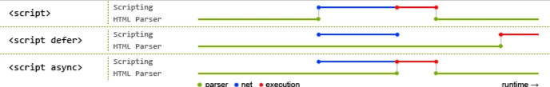

# 总结

## JS执行机制

### 同步任务/异步任务

+ 同步任务: 指的是在主线程上排队执行的任务, 只有当前一个任务执行完毕后才可执行下一个任务。(`按顺序、自上而下`)
+ 异步任务: 指的是不进入主线程, 而进入任务队列的任务。 只有当任务队列通知主线程某个异步任务可以执行, 方可进入主线程进行执行. (`通知主线程后方可执行`)

::: tip 异步任务分为`宏任务`和`微任务`

常见的微任务有: `Promise.then()`, `.then` 中的逻辑是微任务; `process.nextTick(node环境)`.

常见的宏任务有: `setTimeout、setInterval`、`setImmediate(node环境)`、`xhr(发送网络请求)`, `callback`.

同步任务: 除了上面的这些情况, 都属于同步任务

:::

### 任务的执行顺序

> 先到后: 同步任务 -> 微任务 -> 宏任务

### 任务在哪里执行

> 无论是同步任务还是异步任务, 都是在`主线程`执行.

### event loop
> 事件循环(event loop) 就是 任务在主线程不断进栈出栈的一个循环过程。任务会在将要执行时进入主线程，在执行完毕后退出主线程。

#### 循环的步骤
1. 把 `同步任务队列` 或者 `微任务队列` 或者 `宏任务队列` 中的任务放入主线程.
2. `同步任务` 或者 `微任务` 或者 `宏任务` 在执行完毕后会全部退出主线程.

#### 实际场景中
> 同步任务
1. 把同步任务相继加入同步任务队列
2. 把同步任务队列的任务相继加入主线程
3. 待主线程的任务相继执行完毕后, 把主线程队列清空

> 微任务
4. 把微任务相继加入微任务队列
5. 把微任务队列的任务相继加入主线程
6. 待主线程的任务相继执行完毕后, 把主线程队列清空

> 宏任务
7. 把宏任务相继加入宏任务队列. 无 `time` 的先加入, 像网络请求. 有 `time` 后加入, 像 `setTimeout(() => {}, time)`, 
    在他们中 `time` 短的先加入
8. 把宏任务队列的任务相继加入主线程
9. 待主线程的任务相继执行完毕后, 把主线程队列清空

## call, apply, bind 三者的区别

> 共同点: 都可以改变 `this` 指向

::: tip 三者的区别

call 和 apply 会直接调用函数. bind 不会调用函数

call 和 apply 传递的参数不一样, call传递参数使用逗号隔开, apply 使用数组传递

:::

### bind
::: tip bind

+ bind 和 call、apply 功能类似
+ call 和 apply 是临时的改变 this, bind 是永久改变 this
+ call 是 '改变 this', bind 是 '绑定 this'
+ bind 返回的函数, 内部的 this, 永远指向 bind 的第一个参数 (不管以何种方式调用)
+ bind 优先级比 call 高

:::

::: tip bind方法

+ 用来干嘛 => 永久绑定this
+ 参数问题 => 和 call 一致
+ 返回  => 一个和原函数一模一样的函数(和原函数不是同一个)
+ 原函数.bind(绑定的对象, 参数1, 参数2...)

:::

## defer async 的区别

> 当没有 defer 或 async, 浏览器会立即加载并执行指定的脚本, '立即'指的是在渲染该 script 标签
之下的文档元素之前, 也就是不等待后续载入的文档元素, 读到就加载并执行.

> async 加载和渲染后续文档元素的过程将和 script.js 的加载与执行并行进行(异步)

> defer 加载后续文档的过程将和 script.js 的加载并行进行(异步), 但是 script.js 的执行要在
所有元素解析完成之后, `DOMContentLoaded` 事件触发之前完成.

> 蓝色线代表网络读取, 红色线代表执行时间, 这俩都是针对脚本, 绿色线代表 HTML 解析

1. defer 和 async 在网络读取(下载) 这块是一样的, 都是异步的（相较于 HTML 解析）
2. 他俩的差别在于脚本下载完之后何时执行, 显然 defer 是最接近我们对于应用脚本加载和执行的要求的
3. 关于 defer, 此图未尽之处在于他是按照加载顺序执行脚本的, 这一点要善加利用
4. async 则是一个乱序执行的主, 反正对于它来说脚本的加载和执行是紧紧挨着的, 
所以不管你声明的顺序如何, 只要它加载完成就会立刻执行
5. async 对于应用脚本的用处不大, 因为它完全不考虑依赖(哪怕是最低级的顺序执行), 
不过它对于那些可以不依赖任何脚本或不被任何脚本依赖的脚本来说却是非常合适的, 最典型的例子: Google Analytics

::: tip 总结

1. script 会阻碍 html 编译
2. defer 和 async 会告诉浏览器不要等待脚本, 继续执行 html 生成 DOM
3. defer: js 操作DOM时使用, 例如: 轮播图
4. async: 在独立的js中使用, 例如: 广告

defer 与 async 的区别是: 前者要等到整个页面正常渲染结束, 才会执行; 后者一旦下载完, 
渲染引擎就会中断渲染, 执行这个脚本以后, 再继续渲染。

defer 是 '渲染完再执行', async 是 '下载完就执行'

如果有多个 defer 脚本, 会按照他们在页面出现的顺序加载, 而多个 async 脚本是不能保证加载顺序的

:::

## 堆和栈

::: tip 区别

+ 简单数据类型的值在栈里, 可以直接拿. string, number, 布尔, null, undefined, symbol
+ 复杂数据类型的值在堆里, 在栈里存的是地址, 通过地址指向堆里的数据. 堆里的值改变会影响多个数据, object(object, array, function)

:::

## http基础
> ip地址: xxx.xxx.xxx.xxx.xxx 计算机想要接入网络(互联网, 局域网),
都会分配一个唯一的标识, 这个标识就是 ip地址。 通过 ip地址 能够找到某一台计算机.

> 端口号: 每一个程序在计算机上运行, 其实需要占用端口, :80 是 http默认的端口, 
通过端口可以找到具体的程序

> 域名: 例如: `www.baidu.com`, 域名好记. 在 DNS服务器中可以通过域名找到 ip地址.

::: tip 例如

一个完成的url地址: 协议://域名: 端口/path/#hash?queryString

:::

## 浏览器从输入 url 到渲染页面发生了什么
1. 浏览器需要解析域名得到 ip地址 (现在本地的hosts查询, 再去 DNS 服务器查询)
   1. 浏览器会先查询本地C盘下的hosts文件, 看能否通过 hosts 得到对应的ip地址(域名劫持)
   2. 如果没有从本地得到 ip地址, 会查询网络上的 DNS服务器, 根据DNS服务器 得到对应的ip地址
2. 浏览器根据得到的 ip地址 去访问真正的服务器, 请求资源（读取url的path部分）
3. 服务器根据请求的url地址查找对应的资源
（如html, css, js, img, 数据. 服务器去对应的目录查找对应的资源）
4. 服务器把资源响应给浏览器
5. 浏览器解析服务器返回的资源
6. 浏览器渲染页面

::: tip 渲染过程

现代浏览器渲染页面的过程是这样的: 解析HTML以构建DOM树 -> 构建渲染树 -> 布局渲染树 -> 绘制渲染树

:::

## 前端缓存类型有哪些

### 前端做本地数据存储的方式有哪些

+ cookies: 出现的最早, 兼容性好, 容量小(4kb), 当没有设置过期时间, 在用户关闭浏览器时即失效
+ localStorage: 容量较大(5mb~10mb), 永久储存
+ sessionStorage: 容量较大(5mb~10mb), 暂时储存, 关闭页面时数据清除
+ indexedDB: h5出现, 是一种数据库. 容量最大

### http缓存(浏览器缓存): 强制缓存和协商缓存

> `cache-control, expires`: 浏览器发送http请求时, 先查询本地是否有强缓存, 
如果（cache-control）没有过期就直接再本地中取。

强制缓存是给**cache**设置过期时间, 如**expires**(给浏览器设置绝对时间), 
cache-control(保质期), 从响应头携带过来。

如果过期了再向服务器协商缓存, 到了后会判断请求响应头的字段。

::: tip E-tag/Last-Modified

(最好) **E-tag**: 先判断请求头里的 if-not-match与服务器是否一致, **判断文件的版本**, 
如果文件的版本没有变化就返回**403**, 本地读取。如果变化了就返回**200**再向服务器请求资源。

**Last-Modified**: 先判断请求头里的 if-Mastodified-since 与服务器是否一致, **判断文件上次修改时间**, 
如果文件的最后的修改时间没有变化就返回403, 本地读取。如果变化了就返回200再向服务器请求资源

:::

